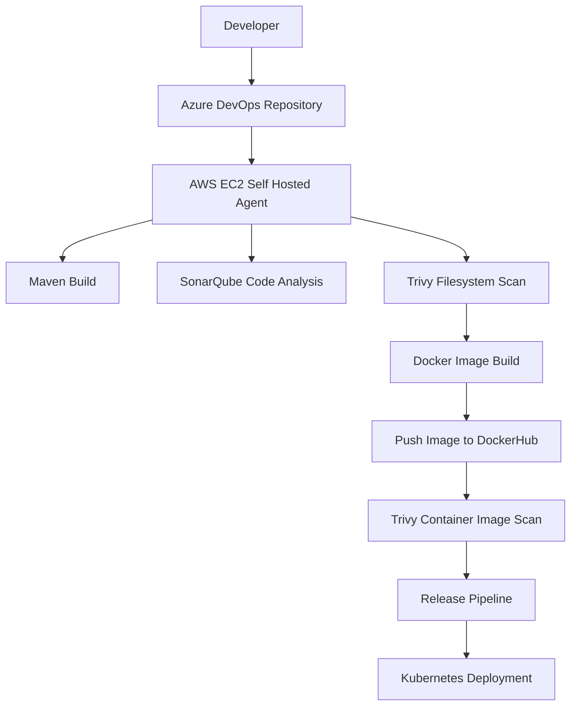
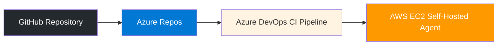
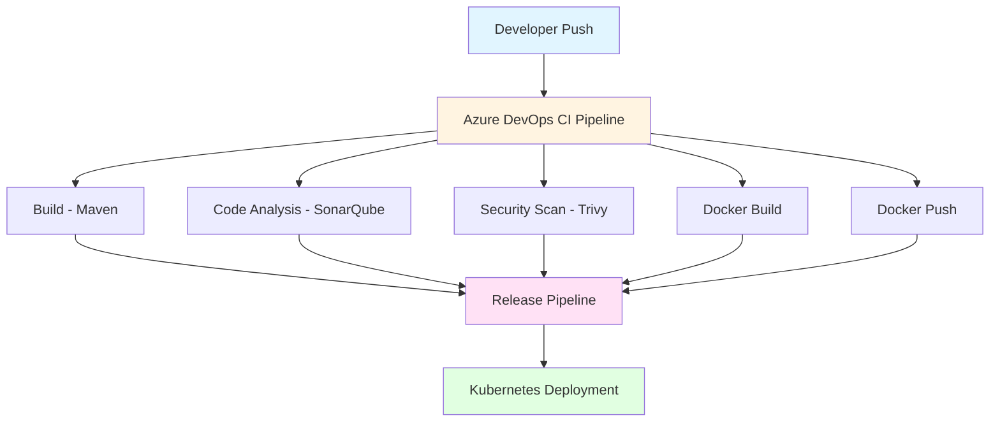

# 🚀 BoardGames DevOps CI/CD Pipeline (Azure DevOps + AWS EC2 Self-Hosted Agent)

This project demonstrates a **complete DevOps CI/CD pipeline** using **Azure DevOps** with a **self-hosted agent running on AWS EC2**.

The pipeline automatically performs:

- Build using Maven
- Code Quality Analysis using SonarQube
- Security Scanning using Trivy
- Docker Image Build
- Push Image to DockerHub
- Container Vulnerability Scanning
- Deployment using Kubernetes

---

## 🏗️ Architecture



---

## 📋 Prerequisites

Before starting this project, ensure you have the following accounts:

- AWS Account
- Azure DevOps Account
- DockerHub Account
- GitHub Account
- Basic Linux knowledge

---

## STEP 1 — Launch AWS EC2 Instance

Go to **AWS Console → EC2 → Launch Instance**

Use the following configuration:

```yaml
Instance type: t2.large
Operating System: Ubuntu 22.04
Storage: 25 GB EBS
Security Group:
    SSH (22)
    HTTP (80)
```

Connect to the instance:

```bash
ssh -i key.pem ubuntu@<public-ip>
```

---

## STEP 2 — Setup DevOps Tools

Create a setup script to install all required tools.

Example tools installed:

- Java
- Maven
- Docker
- Trivy
- Git

Run the setup script:

```bash
chmod +x setup.sh
./setup.sh
```

This prepares the VM for the CI pipeline.

---

## STEP 3 — Configure Docker Permissions

Allow the ubuntu user to run Docker commands:

```bash
sudo usermod -aG docker ubuntu
newgrp docker
```

Verify Docker installation:

```bash
docker --version
```

---

## STEP 4 — Install Azure DevOps Self Hosted Agent

Create agent directory:

```bash
mkdir ~/myagent
cd ~/myagent
```

Download the agent package:

```bash
wget https://vstsagentpackage.azureedge.net/agent/3.236.1/vsts-agent-linux-x64-3.236.1.tar.gz
```

Extract the package:

```bash
tar zxvf vsts-agent-linux-x64-3.236.1.tar.gz
```

---

## STEP 5 — Create Azure DevOps Personal Access Token

Go to:

```
Azure DevOps
→ User Settings
→ Personal Access Tokens
```

Create a token with the following permissions:

- Agent Pools (Read & Manage)
- Build (Read & Execute)
- Release (Read & Execute)

Copy the generated token.

---

## STEP 6 — Configure Self Hosted Agent

Run:

```bash
./config.sh
```

Provide the required inputs:

- Azure DevOps URL
- PAT Token
- Agent Pool Name
- Agent Name
- Work Folder

Example:

```yaml
Pool: java-agent-pool
Agent Name: ec2-agent
Work Folder: _work
```

---

## STEP 7 — Run Agent as a Service

Install the agent as a Linux service:

```bash
sudo ./svc.sh install
sudo ./svc.sh start
```

Verify the agent:

```bash
systemctl status vsts.agent.*
```

The agent should appear **Online** in Azure DevOps Agent Pools.

---

## STEP 8 — Create Azure DevOps Project

Create a new project:

```yaml
Project Name: boardgames-devops
```

---

## STEP 8.1 — Open Azure DevOps

Go to:

```
Azure DevOps → Your Project → Repos
```

---

## STEP 8.2 — Import Repository

Click:

```
Repos → Import Repository
```

---

## STEP 8.3 — Enter GitHub Repository URL

Use the following GitHub repository as the source:

```
https://github.com/Nishath06/Board-Game-Azure-DevOps-Implementation-.git
```

Azure DevOps will automatically import the complete repository into Azure Repos.

---

## STEP 8.4 — Verify Import

After importing, your project files should appear inside:

```
Azure DevOps → Repos → Files
```

The CI pipeline will now use **Azure Repos** as the source repository.

---

## 📌 Repository Flow



---

## STEP 9 — Create CI Pipeline

Navigate to:

```
Pipelines → New Pipeline
```

Configure the pipeline to use the self-hosted agent pool.

Pipeline stages:

1. Maven Build
2. SonarQube Scan
3. Trivy Filesystem Scan
4. Docker Build
5. Docker Push
6. Trivy Image Scan

---

## STEP 10 — Maven Build

Build the Java application:

```bash
mvn clean package
```

This generates the `.jar` artifact.

---

## STEP 11 — SonarQube Code Analysis

SonarQube scans the project for:

- Bugs
- Vulnerabilities
- Code Smells
- Maintainability Issues

---

## STEP 12 — Trivy Filesystem Scan

Scan dependencies for vulnerabilities:

```bash
trivy fs .
```

---

## STEP 13 — Docker Build

Build the Docker image:

```bash
docker build -t nishathjp/boardGames:latest .
```

---

## STEP 14 — Push Image to DockerHub

Login to DockerHub:

```bash
docker login
```

Push image:

```bash
docker push nishathjp/boardGames:latest
```

---

## STEP 15 — Trivy Image Scan

Scan the container image:

```bash
trivy image nishathjp/boardGames:latest
```

---

## STEP 16 — Publish Artifacts

Artifacts published:

- JAR file
- Security reports

Stored in **Azure DevOps Artifacts**.

---

## STEP 17 — Create Release Pipeline

Navigate to:

```
Pipelines → Releases
```

Create stages:

- Build Artifact
- Deploy to Kubernetes

---

## STEP 18 — Deploy to Kubernetes

Apply Kubernetes manifests:

```bash
kubectl apply -f deployment.yaml
kubectl apply -f service.yaml
```

Verify deployment:

```bash
kubectl get pods
kubectl get services
```

---

## 📊 Pipeline Flow



---

## 🧠 Key Learning Outcomes

This project demonstrates:

- CI/CD pipeline design
- Azure DevOps self-hosted agents
- Docker containerization
- DevSecOps security scanning
- Kubernetes deployment
- Cloud infrastructure setup

---

## 👨‍💻 Author

**Nishath JP**

DevOps | Cloud | Automation Enthusiast

---

⭐ If you found this project useful, consider giving it a star on GitHub!